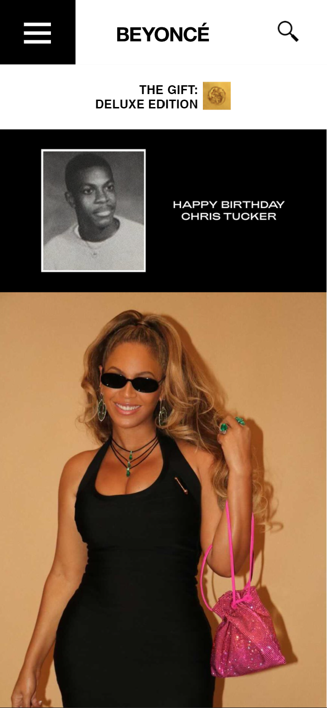
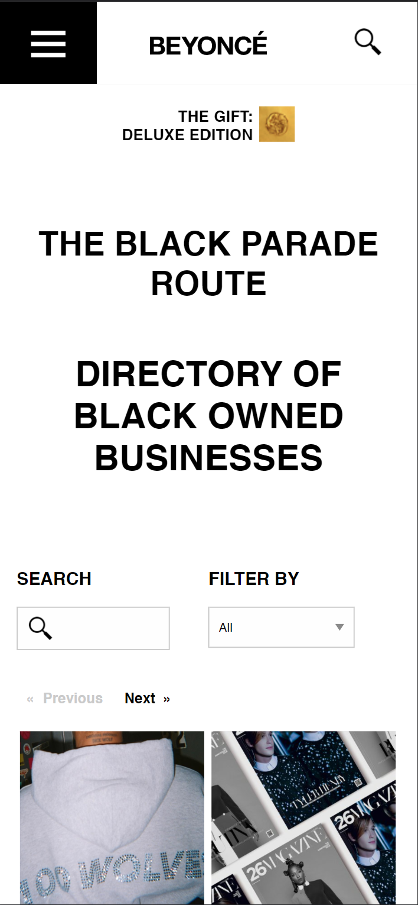
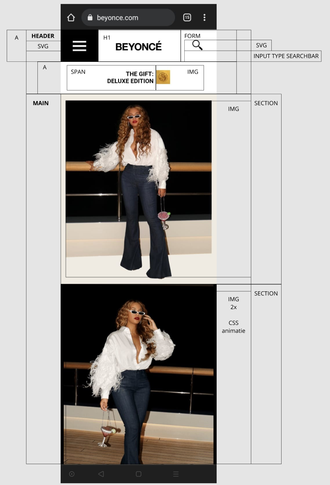
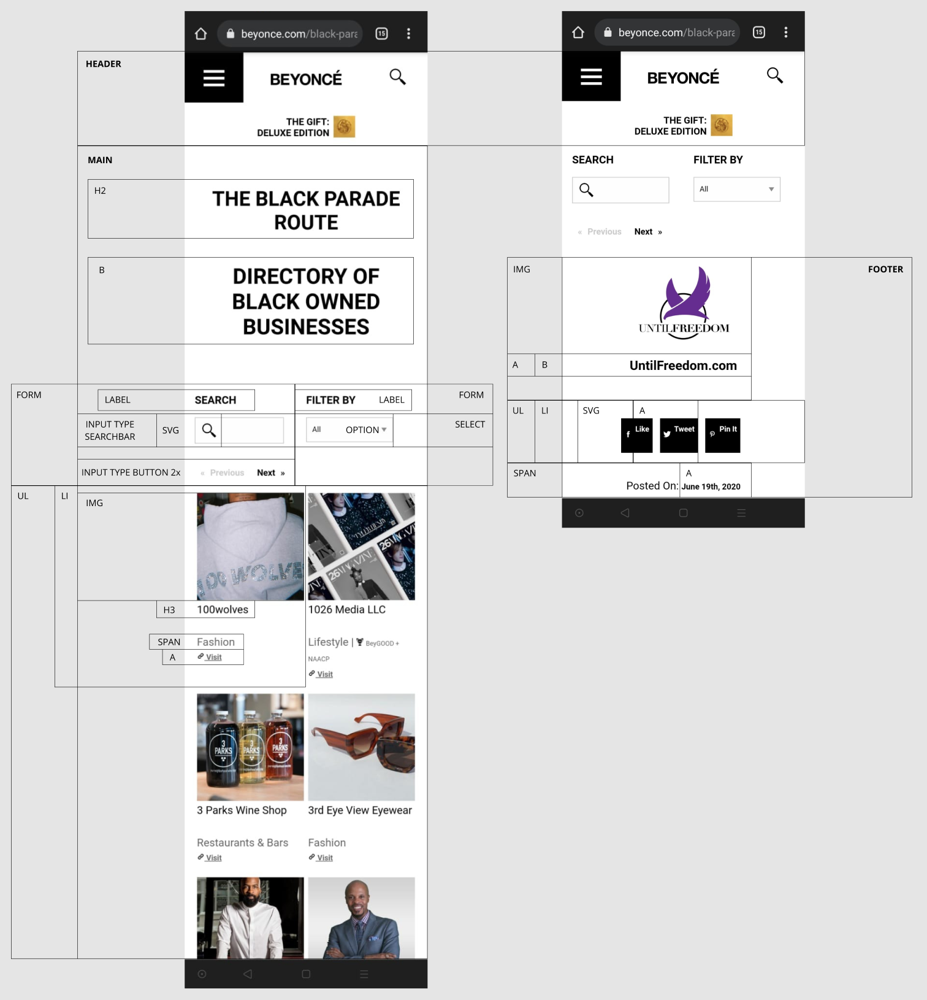
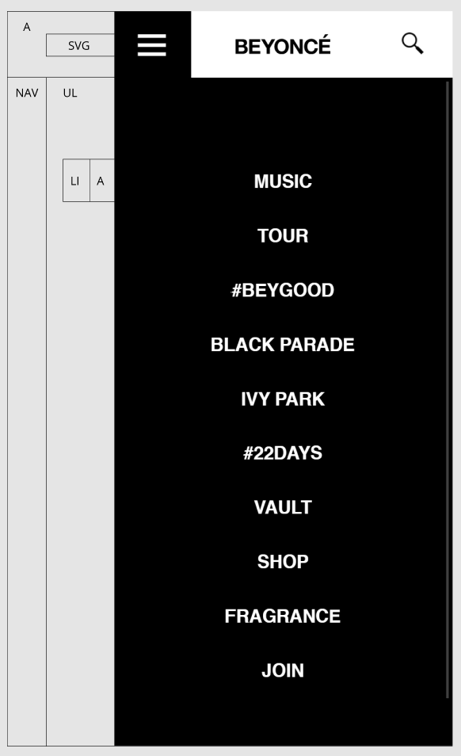
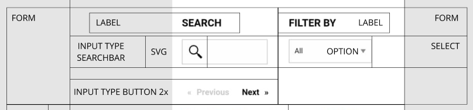
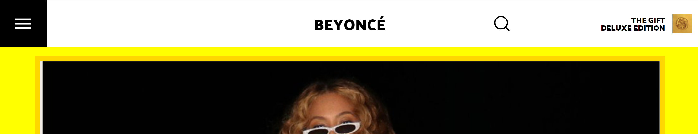
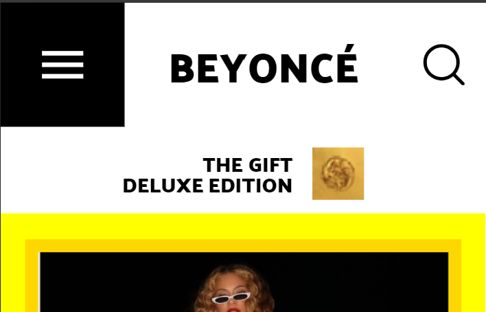
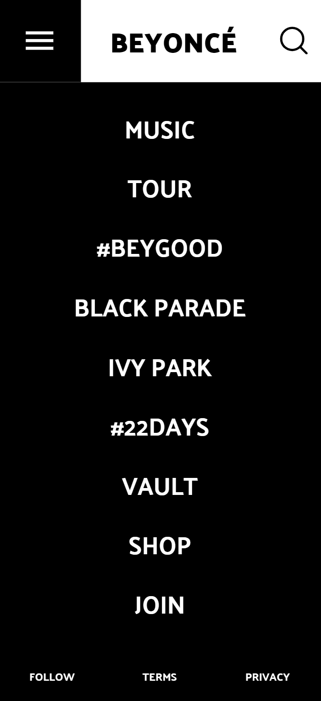

# Procesverslag
Markdown is een simpele manier om HTML te schrijven.  
Markdown cheat cheet: [Hulp bij het schrijven van Markdown](https://github.com/adam-p/markdown-here/wiki/Markdown-Cheatsheet).

Nb. De standaardstructuur en de spartaanse opmaak van de README.md zijn helemaal prima. Het gaat om de inhoud van je procesverslag. Besteedt de tijd voor pracht en praal aan je website.

Nb. Door *open* toe te voegen aan een *details* element kun je deze standaard open zetten. Fijn om dat steeds voor de relevante stuk(ken) te doen.

## Jij

uitwerken voor kick-off werkgroep

### Auteur:
Chigozie Arts

#### Je startniveau:
BabyBlauw

#### Je focus:
Extra aandacht voor de surface laag
 

## Je website

>>https://chigoziearts.github.io/FED__Beyonce/ 

uitwerken voor kick-off werkgroep

### Je opdracht:
www.Beyonce.com + /black-parade-route

#### Screenshot(s) van de eerste pagina (small screen): 
Homepage  

#### Screenshot(s) van de tweede pagina (small screen):
Black Parade Route: Directory of Black Owned Businesses  

 

## Breakdownschets (week 1)

uitwerken na afloop 2e werkgroep

### de hele pagina: 
Breakdown van de hele hoofdpagina  

Breakdown van de hele secundaire pagina (webshop)  

### dynamisch deel (bijv menu): 
Breakdown van het hamburger menu/navigatie  

### wellicht nog een dynamisch deel (bijv filter): 
Breakdown van het zoek en filter menu van de webshop  

## Voortgang 1 (week 2)

uitwerken voor 1e voortgang

### Stand van zaken
Eigenlijk gind de twede week vrij soepel. Gisteren had ik wel veel moeite om me tot het huiswerk te zetten, maar deze kon ik in de les goed inhalen. Zelfstandig gaat het coderen met css ook een stuk soepeler dan in vorige jaren. Maar ik heb zeker de hulp nodig van mijn netwerk en student assistenten, om elementen goed te stijlen. Het moeilijkste deze week was het goed stijlen van de header, en het menu vandaag. Ik blijf alleen een probleem houden met het JS stukje dat ervoor moet zorgen dat dit menu goed functioneerd.

### Agenda voor meeting
samen met je groepje opstellen

| student 1      | student 2          | student 3    | student 4        |
| ---            | ---                | ---          | ---              |
| dit bespreken  | en dit             | en ik dit    | en dan ik dat    |
| en dat ook nog | dit als er tijd is | nog een punt | dit wil ik zeker |
| ...            | ...                | ...          | ...              |

niet aan de orde gekomen

### Verslag van meeting
hier na afloop snel de uitkomsten van de meeting vastleggen

- Vervang de   tussende  op regel 29 voor twee apparte  elementen
- Kijk geregeld of ik mijn code kan opschonen, om orde en overzicht te behouden naarmate er meer bijkomt
- class selectors toevoegen in de html bij home, pagina2, main etc. om nette css te kunnen maken
- Geef de imput elements labels, als verbetering van de site of op display: none

## Voortgang 2 (week 3)

uitwerken voor 2e voortgang

### Stand van zaken
Deze week vond ik het moeilijker om me tot het huiswerk en de opdrachten te zetten. En ik heb ook wat minder harde voorderingen gemaakt met mijn site. Maar het is me wel gelukt om de twede pagina verder te css'en. Nu wil ik de komende week mijn css verder opschonenen terwijl ik de main en footer van de tweede pagina afmaak. Dan kan ik de week daarna de extra surface elementen verbeteren.

### Agenda voor meeting
samen met je groepje opstellen

| student 1      | student 2          | student 3    | student 4        |
| ---            | ---                | ---          | ---              |
| dit bespreken  | en dit             | en ik dit    | en dan ik dat    |
| en dat ook nog | dit als er tijd is | nog een punt | dit wil ik zeker |
| ...            | ...                | ...          | ...              |

### Verslag van meeting
hier na afloop snel de uitkomsten van de meeting vastleggen

- Gebruik css selectoren beter 
- ID maar 1 keer per pagina, liever een class gebruiken voor "TheGift"
- Nagaan of er KamelCasing ergens ontbreekt/ mijn html en css netjes leesbaar zetten
- ...

## Toegankelijkheidstest (week 4)

uitwerken na test in 8e voortgang

### Bevindingen
Lijst met je bevindingen die in de test naar voren kwamen:

#### Central Field Loss
Deze beperking zorgt voor een verlies van het zicht centraal in het gezichtsveld.

Op de originele site had ik de volgende opmerkingen:
homepage: De grote content is fijn, want alleen de boven, onder en zijkanten waren goed zichtbaar. 
pagetwo: De kleine grijze catagorie tekst is slecht te lezen.
algemeen: Op desktop is er nog genoeg breedte om langs de blinde vlek te kijken. Maar voor mobiel is een smal scherm extra moeijlijk. Hiervoor is een hoog contrast mogelijke compensatie. Zoals een 'nightmode'.

#### Titel tweede bevinding. 
Hier korte omschrijving (met indien nodig een afbeelding)

Hier een omschrijving van hoe het opgelost kan worden (met indien nodig een afbeelding)

#### Titel volgende bevinding. 
Hier korte omschrijving (met indien nodig een afbeelding)

Hier een omschrijving van hoe het opgelost kan worden (met indien nodig een afbeelding)

#### Titel nog een bevinding. 
Hier korte omschrijving (met indien nodig een afbeelding)

Hier een omschrijving van hoe het opgelost kan worden (met indien nodig een afbeelding)

## Voortgang 3 (week 4)

uitwerken voor 3e voortgang

### Stand van zaken
hier dit ging goed & dit was lastig (neem ook screenshots op van delen van je website en code)

### Agenda voor meeting
samen met je groepje opstellen

| student 1      | student 2          | student 3    | student 4        |
| ---            | ---                | ---          | ---              |
| dit bespreken  | en dit             | en ik dit    | en dan ik dat    |
| en dat ook nog | dit als er tijd is | nog een punt | dit wil ik zeker |
| ...            | ...                | ...          | ...              |

### Verslag van meeting
hier na afloop snel de uitkomsten van de meeting vastleggen

- punt 1
- punt 2
- nog een punt
- ...

## Eindgesprek (week 5)

uitwerken voor eindgesprek

### Stand van zaken
hier dit ging goed & dit was lastig (neem ook screenshots op van delen van je website en code)

### Screenshot(s)

hier screenshot(s) van je eindresultaat

## Bronnenlijst

continu bijhouden terwijl je werkt

Nb. Wees specifiek ('css-tricks' als bron is bijv. niet specifiek genoeg).

1. bron 1
2. bron 2
3. ...

